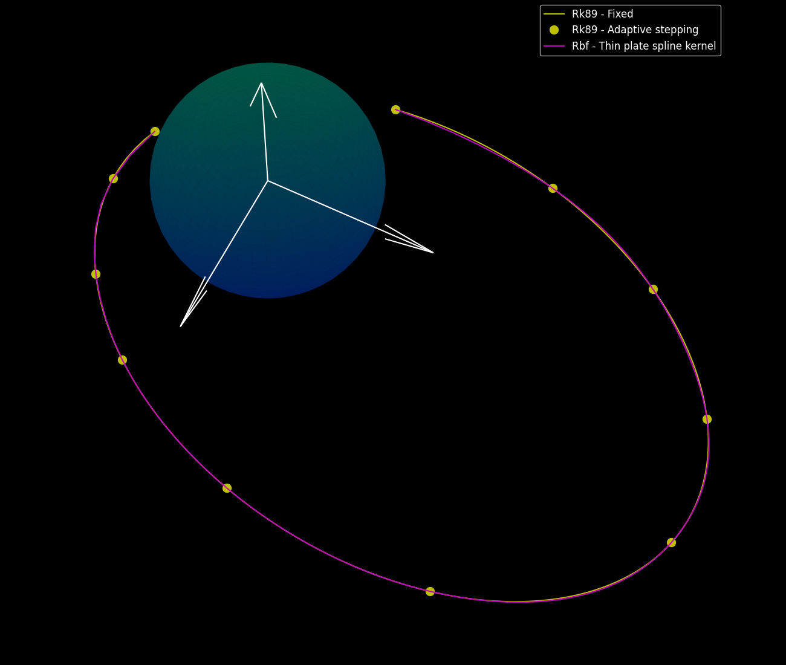
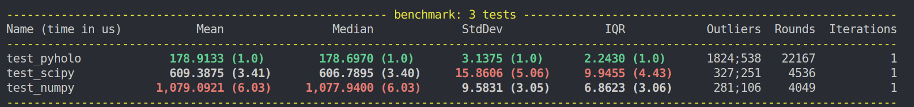

# Hologram
Multipurpose interpolation library with support for Radial Basis Function (RBF).

## Features
- RBF interpolation with many kernels to choose from.
- Normalisation/standardisation tools if necessary.
- Input and output datasets can be of type `Vec<X>` and `Vec<Y>` where `X` and `Y` can be: 
    - `f64`
    - `[f64; 3]`
    - `Vec<f64>`
    - Your type if you implement `Numeric` trait
- Dependency free unless handling larger datasets (use `openblas` or `intel-mkl` feature)
- Lagrangian interpolation with support for Chebyshev nodes (X: `Vec<f64>` and Y: `Vec<[f64; 3]>` only)

## Add to your project
Add the following to your `Cargo.toml` (remove `features` for lightweight option):

```toml
[dependencies]
hologram = { version = "0.1.0", features = ["openblas"]} # or "intel-mkl"
```

## Examples in Rust
### Interpolating 1D data
Using the Hologram library to interpolate can be done as follows:

```rust
use hologram::{Interpolator, rbf::Rbf, kernels::gaussian_kernel, numeric::linspace};
use std::f64::consts::PI;

fn blackbox(x: f64) -> f64 {
    x.powi(2) + x + 2. * (2.0 * std::f64::consts::PI * x).sin()
}

fn main() -> Result<(), String> {
    // Parameters
    let bounds = (-5.0, 5.0);
    let n_points = 50;

    // Set/get inputs and outputs
    let x_train: Vec<f64> = linspace(&bounds.0, &bounds.1, n_points);
    let y_train: Vec<f64> = x_train.iter().map(|x| blackbox(*x)).collect();

    // Create RBF interpolator
    let rbf = Rbf::new(x_train.clone(), y_train, Some(gaussian_kernel), Some(1.0))?;

    // Generate test points
    let n_test = 500;
    let x_test: Vec<f64> = linspace(&bounds.0, &bounds.1, n_test);

    // Make predictions
    let y_pred = rbf.predict(&x_test)?;

    // Plot/compare
    Ok(())
}

```

Plotting against other Rbf implementations (scipy, numpy) and the expected values:


### Interpolating 3D data

```rust
use hologram::{
    kernels::thin_plate_spline_kernel,
    numeric::linspace,
    rbf::Rbf,
    Interpolator,
};

fn main() -> Result<(), String> {
    // Training input: Vec<f64>
    let x_train = vec![
        0.000, 512.000, 1182.490, 1911.273, 2788.547, 
        4227.750, 6481.706, 9609.367, 11773.210, 
        13188.649, 14400.000,
    ];

    // Training output: Vec<[f64; 3]>
    let y_train = vec![
        [6950.000, 0.000, 0.000],
        [5930.999, 4386.866, 974.859],
        [2498.780, 8537.536, 1897.230],
        [-1993.234, 10819.437, 2404.319],
        [-7051.251, 11465.688, 2547.931],
        [-13549.361, 9748.529, 2166.340],
        [-19093.612, 3887.659, 863.924],
        [-18104.032, -5716.279, -1270.284],
        [-11425.229, -10664.783, -2369.952],
        [-4206.775, -11312.308, -2513.846],
        [3167.219, -7987.115, -1774.914],
    ];

    // Predict at 200 new points between min and max of training
    let x_test = linspace(&x_train[0], &x_train.last().unwrap(), 200);

    // Create RBF interpolator using thin-plate kernel
    let rbf = Rbf::new(
        x_train,
        y_train,
        Some(thin_plate_spline_kernel),
        Some(1.0),
    )?;

    // Predict
    let y_pred = rbf.predict(&x_test)?;

    // Plot/compare
    Ok(())
}

```
Plotting against the training data and expected values:


### Implementing normalisation
Using the 3d problem from before we can normalise with z-score normalisation in two ways, explicitly:

```rust
// Normalise the data [Not necessary here, but demonstrating]
let (x_train_normalised, x_mean, x_std) = normalise_data(&x_train);
let (y_train_normalised, y_mean, y_std) = normalise_data(&y_train);

// Create RBF interpolator using thin-plate kernel
let rbf = Rbf::new(
    x_train_normalised,
    y_train_normalised,
    Some(thin_plate_spline_kernel),
    Some(1.0),
)?;

// Normalise test input
let x_test_normalised = normalise_data_with(&x_test, &x_mean, &x_std);

// Predict
let y_pred_normalised = rbf.predict(&x_test_normalised)?;

// Denormalise output
let y_pred = denormalise_data(&y_pred_normalised, &y_mean, &y_std);
```

Or implicitly with `RbfNorm` (Rbf wrapped in normalisation, for API convenience):

```rust
// Create RBF interpolator using thin-plate kernel
let rbf = RbfNorm::new(x_train, y_train, Some(thin_plate_spline_kernel), Some(1.0))?;

// Predict
let y_pred = rbf.predict(&x_test)?;
```

## Python implementation
The python implementation is available in the `pyholo` crate (see Github)

```python
import pyholo as holo

rbf = holo.Rbf(x_train, y_train, 'thin_plate_spline', 1.0)
y_pred = rbf.predict(x_test)
```

Using the hologram linear solver only, as haven't quite figured out how to configure Openblas or Mkl with Pyo3. Help here is appreciated. Simple 1d problem from before benchmarks quite well.


## License
MIT