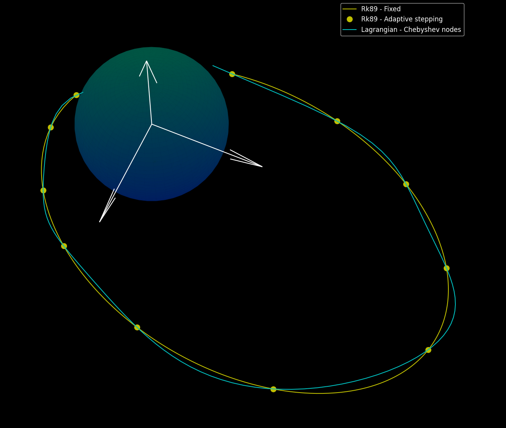

# Halfway
Lightweight interpolation library with support for Radial Basis Function (RBF) and Lagrangian interpolation.

## Features
- RBF interpolation with many kernels to choose from
- Lagrangian interpolation with support for Chebyshev nodes
- Interpolate over many types for x and y including: `Vec<f64>`, `Vec<[f64; 3]>`, and `Vec<Vec<f64>>`. To add more just implement the `Numeric` and `Normalisable` trait for your type.
- Lightweight option is default (no dependencies), but it is recommended to use the `ndarray` feature for larger datasets.

## Add to your project
Add the following to your `Cargo.toml` (remove `features` for lightweight option):

```toml
[dependencies]
halfway = { version = "0.1.0", features = ["ndarray"]}
```

## Examples in Rust
### Using Halfway to interpolate
Using the Halfway library to interpolate can be done as follows:

```rust
fn blackbox(x: f64) -> f64 {
    x.powi(2) + x + 2. * (2.0 * std::f64::consts::PI * x).sin()
}

let x_train: Vec<f64> = ...
let y_train = x_train.iter().map(|x| blackbox(&x)).collect::<Vec<f64>>();

// set the rbf model
let mut rbf = Rbf::new(x_train, y_train, Some(gaussian_kernel), Some(1.0));

// predict
let prediction = rbf.predict(some_x);
```

## Demonstration
RBF interpolation over dataset


Lagrangian interpolation over dataset

