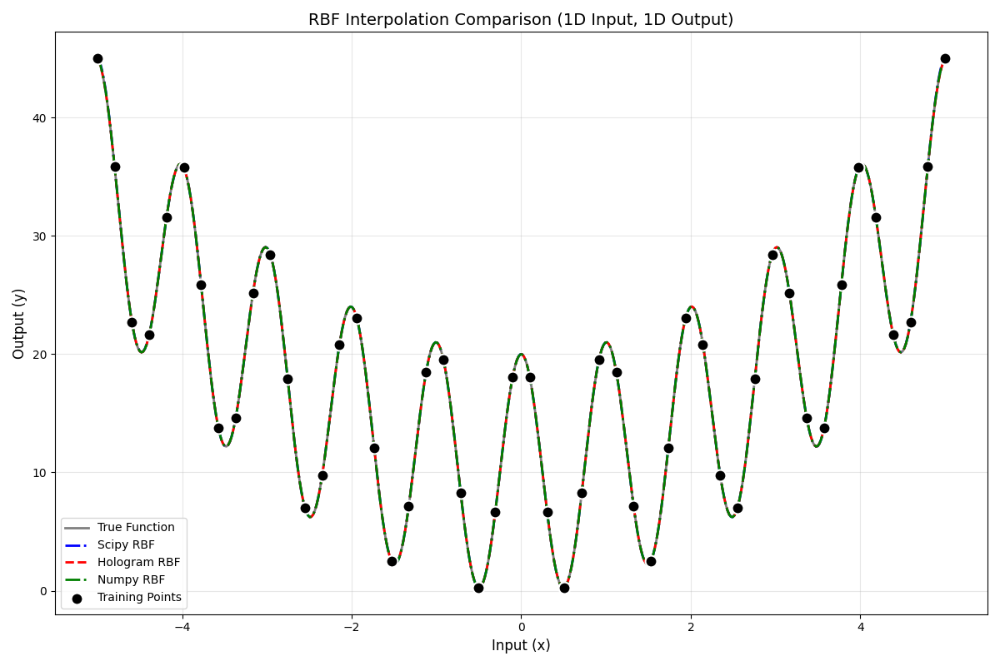

# PyHolo
[](https://github.com/alexlovric/hologram/actions/workflows/build&test.yml)
[](https://opensource.org/licenses/MIT)

Python bindings for flexible interpolation library featuring Radial Basis Function (RBF) written in rust. It features:
- RBF interpolation with many kernels to choose from.
- Flexible Data Types: Supports input and output datasets of type float, list[float], ndarray.

## Installation

```bash
pip install pyholo
```

For optimal performance, it's recommended to use a virtual environment.

## Quick Start

### 1D Interpolation of a target function

```python
import numpy as np
import pyholo as holo

def target_function(pts):
    return 10.0 + np.sum(
        np.power(pts, 2) + 10.0 * np.cos(2.0 * np.pi * pts)
    )

# Get or set input/output data
x_train = np.linspace(-5.0, 5.0, 50)
y_train = np.array([target_function(x) for x in x_train])

# Get predictions from each model
pyholo_pred = holo.Rbf(x_train, y_train, "gaussian", 1.0)

# Points to predict at
x_new = np.linspace(-5.0, 5.0, 500)

# Make predictions
y_pred = pyholo_pred.predict(x_new)
```

Plotting against other Rbf implementations (scipy, numpy) and the expected values:


### 3D interpolation of data

```python
import numpy as np
import pyholo as holo

# Training data
x_train = np.array([
    0.000, 512.000, 1182.490, 1911.273, 2788.547, 
    4227.750, 6481.706, 9609.367, 11773.210, 
    13188.649, 14400.000
])

y_train = np.array([
    [6950.000, 0.000, 0.000],
    [5930.999, 4386.866, 974.859],
    [2498.780, 8537.536, 1897.230],
    [-1993.234, 10819.437, 2404.319],
    [-7051.251, 11465.688, 2547.931],
    [-13549.361, 9748.529, 2166.340],
    [-19093.612, 3887.659, 863.924],
    [-18104.032, -5716.279, -1270.284],
    [-11425.229, -10664.783, -2369.952],
    [-4206.775, -11312.308, -2513.846],
    [3167.219, -7987.115, -1774.914],
])

# Create and fit RBF model
rbf = holo.Rbf(x_train, y_train, kernel='thin_plate_spline', epsilon=1.0)

# Predict on test points
x_test = np.linspace(x_train.min(), x_train.max(), 200)
y_pred = rbf.predict(x_test)
```

Plotting against the training data and expected values:


## License

MIT License - See [LICENSE](LICENSE) for details.
